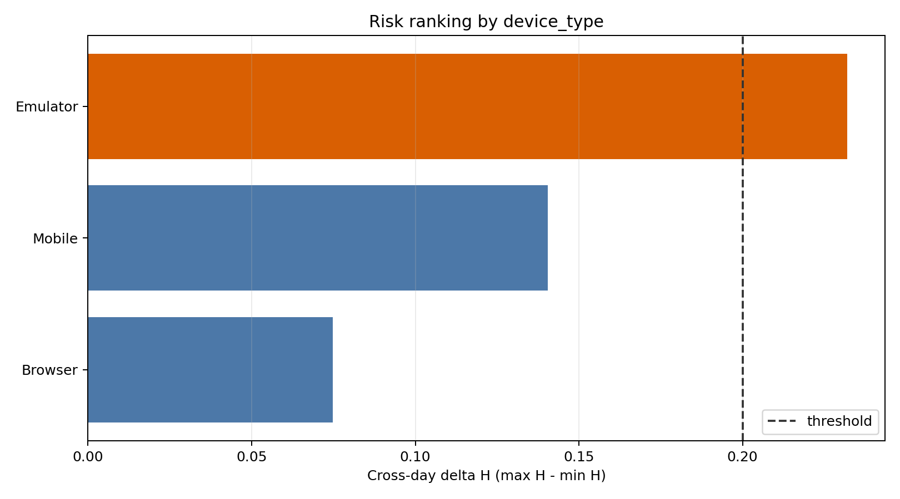
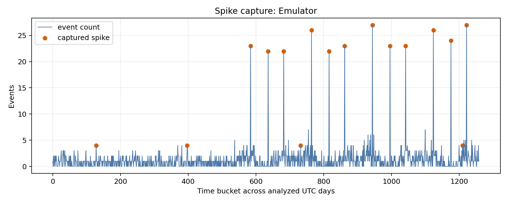

# Cross-day Hurst Change & Spike Capture Demo

這是一個**完全使用模擬資料**的研究型 demo：先把登入／設備事件依指定特徵（`device_type`、`device_id` 或 `ip`）切成每日時間序列，計算每日 Hurst exponent，再用跨日的 `ΔH = max(H) - min(H)` 排出結構變化較大的特徵值，最後從候選特徵的突然突峰時窗中找出相關的 pseudonymous user ID。

> 本專案是風險訊號產生器，不是詐欺定罪器。輸出必須和其他特徵、規則、模型與人工審查交叉驗證；不得單獨用於拒絕服務或處分使用者。





## 流程


## 1 分鐘執行

需要 Python 3.10 以上。建議在新的 virtual environment 執行：

```bash
python -m venv .venv
source .venv/bin/activate        # Windows: .venv\Scripts\activate
python -m pip install -e .

hurst-spike-demo \
  --input data/sample_events.csv \
  --feature device_type \
  --delta-threshold 0.20 \
  --output-dir results
```

也可以不用 console entry point：

```bash
python -m hurst_spike_risk.cli --input data/sample_events.csv --output-dir results
```

重新產生同一份 deterministic 模擬資料：

```bash
python scripts/generate_sample_data.py --output data/sample_events.csv
```

## 輸入格式

CSV 必須包含：

| 欄位 | 說明 |
|---|---|
| `event_time` | 帶 timezone 的 ISO 8601 timestamp；demo 使用 UTC `Z` |
| `user_id` | 已 pseudonymize 的使用者 ID |
| `ip` | IP 特徵；公開 demo 僅使用文件專用網段 |
| `device_id` | 已去識別化的裝置 ID |
| `device_type` | 裝置類型或型號 |

私有來源如何正規化，請看 [`docs/data_dictionary.md`](docs/data_dictionary.md)。程式不依賴任何公司資料表名稱或欄位位置。

## 主要輸出

| 檔案 | 內容 |
|---|---|
| `hurst_by_day.csv` | 各特徵值每天的 H 與 `D = 2 - H` |
| `feature_risk_summary.csv` | `ΔH` 排名及門檻結果 |
| `spike_windows.csv` | 突峰起訖時間、計數與相關 pseudonymous UID |
| `captured_users.csv` | UID 被捕捉到的 spike 時窗數 |
| `risk_overview.png` | 跨日 `ΔH` 排名圖 |
| `spikes_*.png` | 候選特徵的時間序列與突峰位置 |
| `run_metadata.json` | 本次參數與輸出筆數 |

Repository 內的 [`examples/sample_results/`](examples/sample_results/) 是由 checked-in 模擬資料產生，可先查看預期 CSV 結構；它不是任何真實使用者或交易所資料的衍生物。

## 方法摘要

### Hurst exponent

本實作採一階 detrended fluctuation analysis (DFA)：先將去平均的序列積分成 profile，在多個 scale 上做局部線性 detrending，最後以 `log F(s)` 對 `log s` 的斜率估計 H。

請注意：**Hurst exponent H 與 fractal dimension D 不是同一個名稱。** 對一維 self-affine graph，在適用假設下常使用 `D = 2 - H`；因此程式同時輸出兩欄，但不把兩者當成可任意互換的量。

### Cross-day change

對每個特徵值，使用通過最低事件量檢查的每日 H：

```text
delta_hurst = max(daily_hurst) - min(daily_hurst)
```

先依事件量取前 `--top-n-by-volume`，再用 `--delta-threshold` 與 `--top-n-risk` 控制進入 spike 階段的候選數。

### Spike capture

每個時間桶只和前面的 `--target-window` 個桶比較。局部 baseline 使用 recursive tri-partition estimator；當目前計數大於 `--jump-ratio × baseline`，且至少達 `--min-spike-count`，便標記該桶並收集其中的 UID。這個 estimator 是探索型方法，參數必須依實際事件密度回測。

## 可調參數

```text
--feature {device_id,device_type,ip}
--interval-seconds 480
--top-n-by-volume 40
--top-n-risk 3
--delta-threshold 0.20
--jump-ratio 3.0
--target-window 25
--min-events-per-day 20
--min-spike-count 4
```

`--interval-seconds` 必須整除 86,400。所有切日與分桶都以 UTC 執行，避免 DST 或來源 timezone 不一致造成假訊號。

## 測試

```bash
python -m unittest discover -s tests -v
```

## 上傳 GitHub

確認 README 內的 license 與公司政策後，在專案資料夾執行：

```bash
git init
git add .
git commit -m "Initial privacy-safe Hurst and spike demo"
git branch -M main
git remote add origin https://github.com/YOUR_ACCOUNT/YOUR_REPOSITORY.git
git push -u origin main
```

上傳前可用 `git status` 與 `git diff --cached` 再確認沒有把 `data/private/`、原始附件、notebook output 或其他真實資料加入 commit。

## 重要限制

- 每日樣本太少、序列大量為零或只有少數可用 scale 時，H 會不穩定；程式會略過常數／無法估計的序列。
- `ΔH` 大只代表時間結構改變，不等於惡意行為；尖峰也可能是行銷活動、版本發布、重試或批次作業。
- 同一批資料同時拿來調門檻與展示效果會造成過度擬合。正式環境應使用時間切分回測、precision/recall、誤報成本與 drift monitoring。
- UID 捕捉結果只是下一層辨識的候選集合，應再和帳戶、裝置、IP、交易、地理與人工判斷交叉確認。
- 此 demo 沒有包含附件中的真實資料列、IP、UID、device ID、內部檔名或原始圖表。

## 專案結構

```text
.
├── data/sample_events.csv       # 小型 deterministic synthetic data
├── docs/
│   ├── assets/                  # 由 synthetic demo 產生的圖片
│   └── data_dictionary.md
├── examples/sample_results/     # synthetic demo 的參考輸出
├── scripts/generate_sample_data.py
├── src/hurst_spike_risk/
│   ├── analysis.py
│   ├── cli.py
│   ├── core.py
│   └── io.py
├── tests/test_core.py
├── pyproject.toml
├── SECURITY.md
└── LICENSE
```

## License

MIT. 正式發布前請依你的公司政策確認程式碼所有權、資料使用規範與是否需要更換 license。
